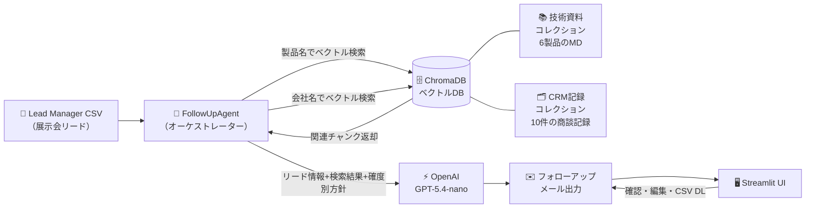
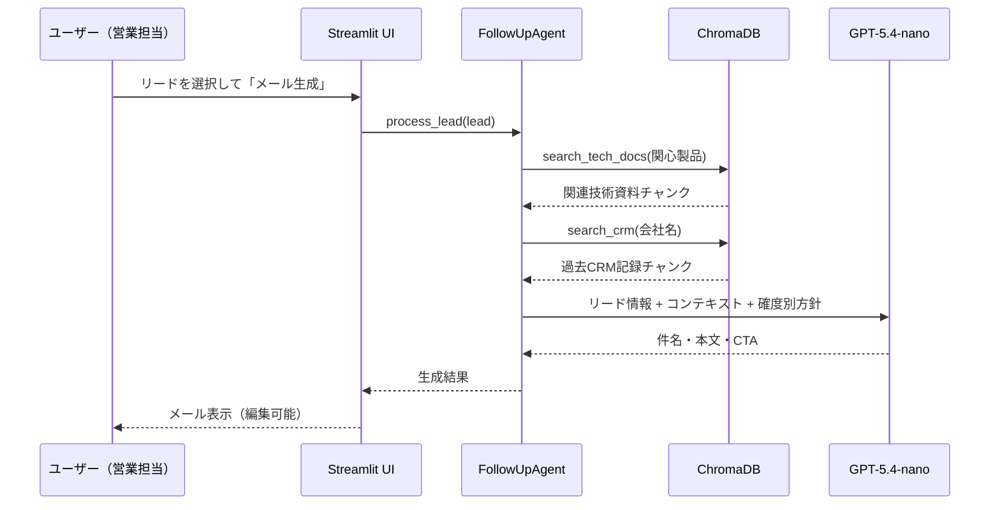

# 🏭 展示会フォローアップAIエージェント


製造業DX特化の架空SIer「**NTX株式会社**」が展示会で獲得したリードに対し、
RAGによるパーソナライズされたフォローアップメールを自動生成するAIエージェント。

商談確度（A〜E）・関心製品・過去CRM履歴をもとに、メールの内容・トーン・CTAを自動調整。
営業担当の手動メール作成工数を削減し、フォロー漏れを防ぐことを目的としています。

---

## 📸 デモ

<!-- TODO: スクリーンショットを貼る -->
<!--  -->
<!--  -->

> ※ スクリーンショットは後ほど追加予定

---

## 📌 背景と課題

### 展示会フォローアップの現状

展示会では Lead Manager でリード情報（氏名・会社・関心製品・営業メモ）を取得しますが、
その後のフォローアップメールは**営業担当が1件ずつ手動で作成**するのが一般的です。

| 課題 | 内容 |
|------|------|
| **工数の大きさ** | 20件のフォローに1件20分かかると約7時間の作業 |
| **パーソナライズの限界** | 時間が足りずテンプレートメールを使い回しがち |
| **フォロー漏れ** | 商談確度の低いリードは後回しにされやすい |
| **ナレッジの断絶** | 過去CRM履歴・製品技術資料が活かされない |

### 本システムの解決策

```
リード情報（CSV）
    + 社内技術資料（製品仕様・事例）  ──→  RAG検索
    + 過去CRM商談記録                        ↓
                                       LLMがメール生成
                                       （商談確度別トーン自動調整）
```

### HubSpot等の既存MAツールとの差別化

既存のMAツールはテンプレートベースのシーケンスメールが中心です。
本システムは**社内の非公開ナレッジ（技術資料・CRM記録）をRAGで活用**できる点が
最大の差別化ポイントです。

| 比較軸 | HubSpot等MA | 本システム |
|--------|------------|-----------|
| 個別パーソナライズ | テンプレート変数置換 | 技術資料×CRM履歴をLLMが統合 |
| 社内ナレッジ活用 | ✗ | ✅ RAGでリアルタイム検索 |
| 商談確度別トーン | 手動設定 | ✅ A〜E自動切替 |
| 初期コスト | 高（月額SaaS） | 低（APIコスト$1未満/20件） |

---

## 🏗️ アーキテクチャ



### データフロー



---

## ✨ 主な機能

- **Lead Manager CSV 対応**: 展示会リードデータをそのまま読み込み
- **RAG自動検索**: 関心製品→技術資料、会社名→CRM履歴を自動でベクトル検索
- **商談確度別メール方針**: A（即フォロー/デモ提案）〜E（軽いお礼）の5段階を自動切替
- **Streamlit UI**: メール確認・編集・個別/一括生成をブラウザ上で操作
- **CSV ダウンロード**: 生成結果をExcel対応CSV（UTF-8 BOM）でダウンロード
- **Contextual Retrieval**: 各チャンク先頭にドキュメントタイトルを付加し検索精度を向上

---

## 🛠️ 技術スタック

| カテゴリ | 技術 | 採用理由 |
|---------|------|---------|
| LLM | OpenAI GPT-5.4-nano | コスト効率が最も高く、メール生成タスクに十分な品質。入力$0.20/M tokens |
| Embedding | OpenAI text-embedding-3-small | 高精度・低コスト |
| ベクトルDB | ChromaDB | ローカル永続化・プロトタイプに最適 |
| フレームワーク | LangChain | Embedding/VectorStore抽象化 |
| UI | Streamlit | Pythonのみで高速にUI構築 |
| 言語 | Python 3.11+ | 型ヒント・非同期処理の充実 |

---

## 🚀 セットアップ

### 前提条件

| ソフトウェア | バージョン | 確認コマンド |
|------------|-----------|------------|
| Python | 3.11 以上 | `python --version` |
| Git | 任意 | `git --version` |

### 1. リポジトリのクローン

```bash
git clone https://github.com/syakuta0024/exhibition-followup-agent.git
cd exhibition-followup-agent
```

### 2. 仮想環境の作成・有効化

```bash
# 仮想環境を作成
python -m venv .venv

# 有効化（Mac / Linux）
source .venv/bin/activate

# 有効化（Windows PowerShell）
.venv\Scripts\Activate.ps1

# 有効化（Windows コマンドプロンプト）
.venv\Scripts\activate.bat
```

### 3. 依存パッケージのインストール

```bash
pip install -r requirements.txt
```

### 4. APIキーの設定

```bash
# .env.example をコピー
cp .env.example .env
```

`.env` を開いて `OPENAI_API_KEY` に実際のキーを設定してください。

```env
OPENAI_API_KEY=sk-proj-xxxxxxxxxxxxxxxx
```

> OpenAI APIキーは https://platform.openai.com/api-keys から取得できます。

### 5. ベクトルDBの構築

```bash
python -m src.vectordb
```

技術資料6件・CRM記録10件が ChromaDB に格納されます。

### 6. アプリの起動

```bash
streamlit run app.py
```

ブラウザで `http://localhost:8501` が開きます。

---

## 📖 使い方

### 1. ナレッジベース構築
サイドバーの **「🔨 ナレッジベース構築」** ボタンをクリック。
技術資料とCRM記録がベクトルDBに格納されます（初回のみ）。

### 2. リード一覧の確認
「📋 リード一覧」タブで展示会リードを確認。
サイドバーの商談確度フィルターで絞り込みが可能です。

### 3. メール生成（個別）
「✉️ メール生成」タブでリードを選択し、**「📧 メール生成」** をクリック。
件名・本文・CTAが生成され、その場で編集できます。

### 4. 一括生成
「✉️ メール生成」タブ下部の **「🔄 全件一括生成」** でフィルタ済み全リードを処理。
プログレスバーで進捗を確認できます。

### 5. 結果のダウンロード
「📊 生成履歴・ダウンロード」タブで生成結果を確認し、
**「📥 生成結果をCSVでダウンロード」** ボタンでExcel対応CSVをダウンロードできます。

---

## 📁 プロジェクト構成

```
exhibition-followup-agent/
├── app.py                        # Streamlitアプリ エントリーポイント
├── requirements.txt              # 依存パッケージ
├── .env.example                  # 環境変数テンプレート
├── .gitignore
│
├── data/
│   ├── leads.csv                 # 展示会リードデータ（18件・架空）
│   ├── tech_documents/           # 製品技術資料（6製品・Markdown）
│   │   ├── sorani_iot_platform.md
│   │   ├── digima_digital_twin.md
│   │   ├── smartvision_smart_glass.md
│   │   ├── ntx_ocr.md
│   │   ├── factorybrain_production.md
│   │   └── edgeguard_anomaly.md
│   └── crm_records/              # 過去CRM商談記録（10件・Markdown）
│       └── crm_001.md 〜 crm_010.md
│
├── src/
│   ├── config.py                 # 環境変数・定数管理
│   ├── vectordb.py               # ChromaDB操作・RAG検索
│   ├── agent.py                  # フォローアップエージェント（オーケストレーター）
│   ├── email_generator.py        # OpenAI GPTによるメール生成
│   └── utils.py                  # データ読み込み・ユーティリティ
│
└── docs/
    └── architecture.md           # アーキテクチャ詳細ドキュメント
```

---

## 💡 技術的なポイント

### 1. RAG + Contextual Retrieval

各チャンクの先頭にドキュメントタイトルと種別を付加することで、
チャンク単体でも文書の文脈が伝わる設計にしています。

```
# 通常のチャンク
「振動センサー：高周波振動（〜20kHz）の周波数分析...」

# Contextual Retrieval 適用後
「[製品技術資料: EdgeGuard] # EdgeGuard - エッジAI異常検知システム
振動センサー：高周波振動（〜20kHz）の周波数分析...」
```

これにより、製品名が本文に登場しないチャンクでも正しい製品文脈での検索が可能になります。

### 2. 商談確度別メール方針（A〜Eの5段階）

```python
RANK_POLICY = {
    "A": "デモ・商談日程を提案。技術的に深い内容。今週中のアポイントを促す",
    "B": "製品詳細資料の送付案内。課題解決事例を紹介",
    "C": "お礼 + 関心製品の概要資料案内。プレッシャーをかけない",
    "D": "シンプルなお礼 + 中小向けプランの紹介",
    "E": "軽いお礼 + カタログ送付のみ",
}
```

### 3. 1コレクション + メタデータフィルタリング

技術資料とCRM記録を1つのChromaDBコレクションに格納し、
`source_type` メタデータでフィルタリングする設計です。

```python
# 技術資料のみ検索
db.search(query, filter_metadata={"source_type": "tech_doc"})

# CRM記録のみ検索
db.search(query, filter_metadata={"source_type": "crm_record"})
```

2コレクション構成と比べてインデックス管理がシンプルになります。

### 4. シンプルなオーケストレーター設計

LangChainのReActエージェントは使わず、
`FollowUpAgent` が検索→生成のパイプラインを直接制御する設計にしています。
これにより**動作が予測可能**で、デバッグが容易です。

---

## 🔭 今後の展望

| 拡張項目 | 概要 |
|---------|------|
| **ハイブリッド検索** | ベクトル検索 + BM25キーワード検索で検索精度向上 |
| **Supabase pgvector 移行** | ローカルChromaDBからクラウドDBへ移行し本番運用対応 |
| **MCP対応** | Model Context Protocol でCRMツールをエージェントに統合 |
| **メール送信API連携** | SendGrid等と連携し承認後に自動送信 |
| **評価基盤の構築** | 生成メールの品質スコアリング（関連性・トーン・CTA明確さ） |
| **マルチモーダル対応** | 展示ブース写真・製品デモ動画をコンテキストに追加 |

---

## ⚠️ 注意事項

- 本プロジェクトのデータは**全て架空のダミーデータ**です
- 実在する企業・個人・製品とは一切関係ありません
- APIキーは `.env` で管理し、リポジトリにはコミットしません
- `.env` は `.gitignore` に含まれています

---

## 📄 ライセンス

MIT License

---

## 👤 著者

<!-- TODO: 名前とGitHubプロフィールリンクを入れる -->
<!-- **Your Name** – [@yourhandle](https://github.com/yourhandle) -->
