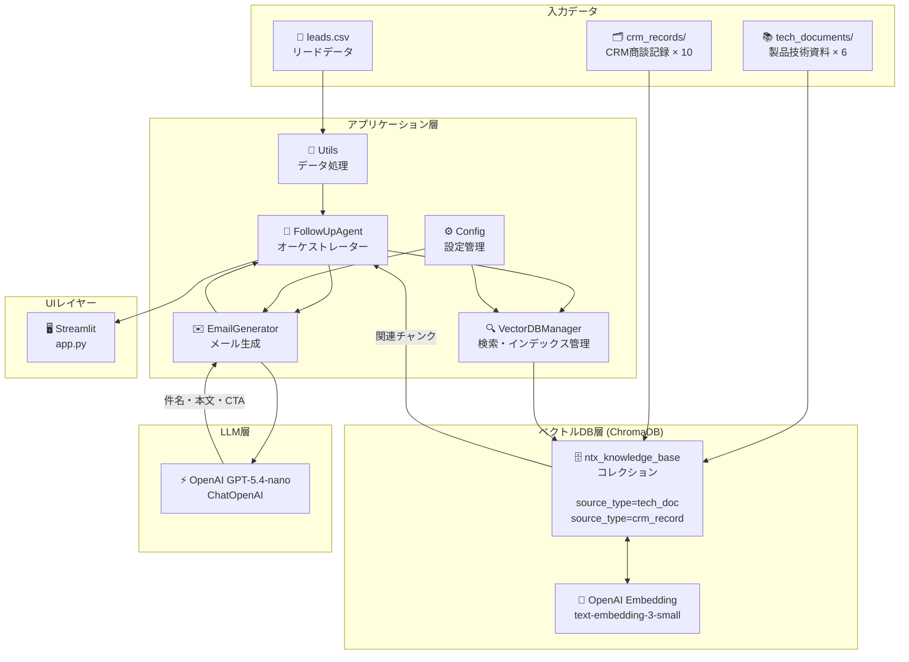
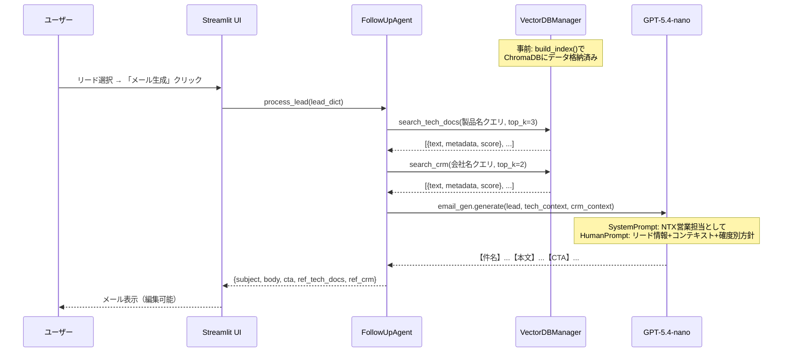

# アーキテクチャ詳細ドキュメント

## 1. システム概要

NTX展示会フォローアップエージェントは、RAG（Retrieval-Augmented Generation）を活用した
メール自動生成システムです。展示会リードデータ・社内技術資料・過去CRM記録を組み合わせ、
商談確度に応じたパーソナライズされたフォローアップメールをLLMで生成します。

---

## 2. アーキテクチャ図



---

## 3. データフロー



---

## 4. コンポーネントの責務と設計判断

### 4.1 FollowUpAgent（オーケストレーター）

**責務**: 検索→生成のパイプライン制御

**設計判断: LangChain ReActエージェントを使わない理由**

ReActエージェントはツール選択をLLMが動的に判断しますが、
本システムのフローは「技術資料検索→CRM検索→メール生成」と固定されています。
動的なツール選択が不要なため、シンプルなオーケストレーター設計を採用しました。

| 比較 | ReActエージェント | オーケストレーター（採用） |
|------|-----------------|----------------------|
| 動作の予測可能性 | 低（LLMが判断） | 高（コードで制御） |
| デバッグのしやすさ | 難しい | 容易 |
| レイテンシ | 高（複数LLM呼び出し） | 低（1回のLLM呼び出し） |
| 適用場面 | フロー未定・複雑なタスク | フロー固定・シンプルなタスク |

### 4.2 VectorDBManager（ベクトルDB操作）

**責務**: ChromaDBのインデックス構築・検索・管理

**設計判断: ChromaDBを選んだ理由**

| 比較 | ChromaDB（採用） | Supabase pgvector | Pinecone |
|------|----------------|-----------------|---------|
| 初期コスト | ✅ 無料（ローカル） | 無料枠あり | 有料 |
| セットアップ | ✅ pip一発 | DB構築が必要 | APIキーのみ |
| スケーラビリティ | ローカル限定 | ✅ 本番対応 | ✅ 本番対応 |
| プロトタイプ向き | ✅ 最適 | 可 | 可 |

プロトタイプ・ポートフォリオとしての用途ではChromaDBが最適です。
本番移行時はSupabase pgvectorへの切り替えが容易です（LangChainが抽象化）。

**設計判断: 1コレクション + メタデータフィルタリング**

技術資料とCRM記録を別コレクションに分ける案もありましたが、
1コレクション内で `source_type` メタデータでフィルタリングする設計を採用しました。

```python
# 技術資料のみ
db.search(query, filter_metadata={"source_type": "tech_doc"})

# CRM記録のみ
db.search(query, filter_metadata={"source_type": "crm_record"})

# 全体横断
db.search(query)  # フィルタなし
```

| 比較 | 2コレクション構成 | 1コレクション構成（採用） |
|------|----------------|----------------------|
| 管理の複雑さ | 高（2つのインスタンス） | ✅ 低（1つのインスタンス） |
| 全体横断検索 | 要マージ処理 | ✅ フィルタなしで即座に実行 |
| 拡張性 | データ種別ごとに分離 | メタデータ追加で対応 |

### 4.3 EmailGenerator（メール生成）

**責務**: LLMを使ったメール文面の生成・パース

**商談確度別プロンプト設計**

```python
RANK_POLICY = {
    "A": {
        "tone": "積極的・具体的",
        "instruction": "デモ・商談日程を具体的に提案。技術的に深い内容。今週〜来週中のアポイントを促す"
    },
    "B": { "tone": "丁寧・提案型", "instruction": "製品詳細資料案内 + 課題解決事例 + オンライン説明会提案" },
    "C": { "tone": "控えめ・情報提供型", "instruction": "お礼 + 関心製品概要案内。プレッシャーをかけない" },
    "D": { "tone": "シンプル・親しみやすい", "instruction": "短いお礼 + 中小向けプランの紹介" },
    "E": { "tone": "最小限", "instruction": "軽いお礼 + カタログ送付のみ。CTAなし" },
}
```

**出力フォーマットの明示**

LLMの出力を確実にパースするため、出力形式を明示的に指示します。

```
【件名】
（件名テキスト）

【本文】
（メール本文）

【CTA】
（次のアクション）
```

**設計判断: OpenAI GPT-5.4-nanoを選んだ理由**

| 比較 | GPT-4o | GPT-5.4-nano（採用） | GPT-4.1-mini |
|------|--------|---------------------|--------------|
| 日本語品質 | 最高 | ✅ メール生成に十分な品質 | 高品質 |
| コスト | 高 | ✅ 最もコスト効率が高い（入力$0.20/M tokens） | 低コスト |
| メール生成タスク | オーバースペック | ✅ 最適 | 適切 |

### 4.4 Embedding モデルの選定

**text-embedding-3-small を選んだ理由**

| 比較 | text-embedding-3-large | text-embedding-3-small（採用） | text-embedding-ada-002 |
|------|----------------------|-----------------------------|----------------------|
| 精度 | 最高 | ✅ 高精度 | 普通 |
| コスト | 高 | ✅ 低コスト ($0.02/1M tokens) | 中 |
| 次元数 | 3072 | 1536 | 1536 |

製造業の日本語技術文書に対して十分な精度を確認しています。

---

## 5. ベクトルDBの設計

### 5.1 ドキュメントの格納形式

```
コレクション: ntx_knowledge_base
│
├── [tech_doc チャンク群]
│   ├── chunk: "[製品技術資料: EdgeGuard] # EdgeGuard - エッジAI異常検知システム\n\n## 製品概要..."
│   ├── metadata: { source_type: "tech_doc", product_name: "EdgeGuard", source_file: "edgeguard_anomaly.md" }
│   └── ...
│
└── [crm_record チャンク群]
    ├── chunk: "[CRM商談記録: CRM_001] # 商談記録 CRM-001\n\n## 基本情報..."
    ├── metadata: { source_type: "crm_record", source_file: "crm_001.md" }
    └── ...
```

### 5.2 Contextual Retrieval の実装

各チャンクの先頭にドキュメントのタイトルと種別を付加しています。

```python
def _build_context_prefix(title, source_type, metadata):
    if source_type == "tech_doc":
        product = metadata.get("product_name", "不明")
        return f"[製品技術資料: {product}] {title}\n\n"
    elif source_type == "crm_record":
        crm_id = os.path.splitext(source_file)[0].upper()
        return f"[CRM商談記録: {crm_id}] {title}\n\n"
```

**効果**: 製品名や会社名が本文中に登場しない末尾チャンクでも、
プレフィックスにより正しい文書文脈で検索・ランキングされます。

---

## 6. チャンキング戦略

### 設定値

```python
RecursiveCharacterTextSplitter(
    chunk_size=600,      # 1チャンクあたり最大600文字（日本語最適化）
    chunk_overlap=150,   # 前後チャンクとの重複150文字
    separators=["\n## ", "\n### ", "\n\n", "\n", "。", "、"],
)
```

### chunk_size=600 の根拠

- **小さすぎる（〜300文字）**: 文脈が失われ、製品の「機能」と「効果」が別チャンクに断片化される
- **大きすぎる（1500文字〜）**: 1チャンクに複数トピックが混在し、検索の精度が低下
- **600文字**: 日本語は英語より情報密度が高いため800より小さい600文字が1セクション収録に最適

### chunk_overlap=150 の根拠

- セクション境界をまたぐ情報（例:「導入効果」の冒頭と「事例」の末尾）が
  どちらのチャンクにも含まれるよう重複を設定
- 重複が多すぎるとインデックスサイズが増大するため、chunk_sizeの25%（150文字）を設定

### separatorsの工夫

日本語MarkdownのセクションHeading（`\n## `）を優先的な区切りとして指定することで、
製品の論理的なセクション単位でチャンク分割されやすくしています。

---

## 7. コンポーネント一覧

| ファイル | クラス/関数 | 責務 |
|---------|----------|------|
| `src/config.py` | `Config` | 環境変数・定数の一元管理 |
| `src/vectordb.py` | `VectorDBManager` | ChromaDB操作・インデックス構築・検索 |
| `src/agent.py` | `FollowUpAgent` | 検索→生成パイプラインのオーケストレーション |
| `src/email_generator.py` | `EmailGenerator` | LLMへのプロンプト構築・メール生成・パース |
| `src/utils.py` | 各関数 | CSV読み込み・データ整形・ログ・CSV保存 |
| `app.py` | `main()` | StreamlitアプリのUI描画・セッション管理 |
