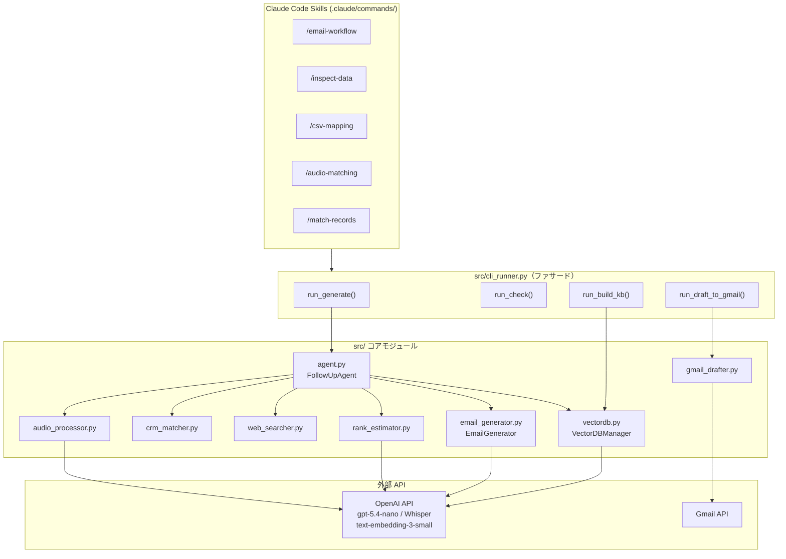

# 展示会フォローアップAIエージェント — システム概要資料

**バージョン**: 2026年5月時点  
**対象読者**: DX推進担当・技術担当者・営業マネージャー

---

## 1. 背景と課題

### 1-1. 展示会フォローアップの現状

製造業の展示会では1回あたり数百〜2,000件のリードを獲得します。しかし翌営業日に全員へパーソナライズされたフォローアップメールを送ることは、現実的に困難です。

| 課題 | 内容 |
|---|---|
| **時間** | 1件あたり5〜10分 × 2,000件 = 最大333時間（1人では不可能） |
| **品質のばらつき** | 担当者ごとにメールの質・スピードが異なる |
| **情報の散逸** | 当日の会話メモが活かされないまま定型文を送信 |
| **機会損失** | 反応が早いほど成約率が高いが、フォローが翌週以降になりがち |

### 1-2. 現場情報の記録課題と音声活用の提案

展示会ブースでの会話には、名刺やアンケートには書かれない重要情報が含まれています。

- 「今期中に予算を確保したい」（予算感・タイムライン）
- 「現場の課長は乗り気だが役員承認が必要」（決裁プロセス）
- 「競合の○○も検討している」（競合状況）

これらの情報は現状、担当者の手書きメモや記憶に頼っています。その結果、記載漏れや個人差による解釈のばらつきが避けられません。フォローアップメールが来場者の関心と噛み合わない、ピント外れな内容になる原因の一つです。

本システムは、展示会当日の来場者との会話を音声録音し、その内容を自動で文字起こし・構造化するオペレーションを**運用ルールとして新たに導入する**ことを前提として設計しています。音声テキストは手書きメモと比較して、次の点で優れています。

- **網羅性**: 会話全体を記録するため、漏れが生じない
- **客観性**: 担当者の解釈フィルターを通さず、顧客の言葉をそのまま残せる
- **構造化**: AIによるニーズ・課題・温度感の自動抽出が可能

音声活用は既存資産の掘り起こしではなく、本システムとともに導入する新しい現場プラクティスとして位置づけています。

---

## 2. 解決アプローチ（v1）— Streamlit版

### 2-1. 目的

> 展示会翌日の午前中に、2,000件のリード全員へ個別最適化されたフォローアップメールを送れる状態にする。

### 2-2. v1のアプローチ

v1（Streamlit版）は、この目的を達成するためのプロトタイプとして設計しました。

```
【従来】
名刺 → 手入力 → 定型文コピペ → 修正 → 送信
（1件5〜10分 × 2,000件）

【v1（本システム）】
CSV アップロード → AI自動処理 → Web UI で確認 → CSV ダウンロード
（1件8〜11秒 × 2,000件 ＋ 音声がある場合はニーズを優先反映）
```

作業削減率: 約 **60〜70%**

### 2-3. Streamlitを選んだ理由

プロトタイプのUIフレームワークとしてStreamlitを選択した理由は3点です。

1. **開発速度**: Pythonのみで完結するため、フロントエンド技術なしに素早くWeb UIを立ち上げられる
2. **可視化の容易さ**: 処理ステップの進捗・カラムマッピング確認・生成結果のプレビューを短いコードで実現できる
3. **実証フェーズに適している**: 機能検証が優先の初期段階では、UIの洗練より動く状態にすることが重要だった

### 2-4. v1で実現したこと

v1の7ステップ処理パイプライン:

1. **CSVインポート＆カラムマッピング**: Lead Manager / Q-PASS / Sansan等の多様なカラム名を自動正規化
2. **ランク正規化・LLM推定**: ★5や数字などをA〜Eに変換。変換不能時はLLMで推定
3. **RAG検索**: ChromaDB + BM25 ハイブリッド検索で関連製品資料を取得
4. **CRM照合**: メール完全一致→社名ファジーマッチで過去商談履歴を紐づけ
5. **Web検索**: DuckDuckGoで企業プロフィール・最新動向を取得（APIキー不要）
6. **音声文字起こし・ニーズ抽出**: Whisper API → LLMで課題・予算・温度感を構造化
7. **メール生成**: ランク別ポリシー + 全コンテキストを統合してLLMでメール生成

---

## 3. 設計のピボット（v2への移行）

v1（Streamlit版）からv2（Claude Code Skills版）への移行は、単なる技術選定の変更ではなく、システムの根幹をなす設計判断の見直しでした。本章では、その判断に至った2つの観点と、移行を可能にした既存設計の意義について述べます。

### 3-1. AIエージェント時代という大局

近年、「自然言語でソフトウェアを操作する」AIエージェントが急速に普及し始めています。ユーザーがボタンをクリックし、フォームを埋め、メニューを辿るという従来のUI操作は、AIが間に入ることで根本から変わりつつあります。これは展示会フォローアップという個別の業務に留まらない、ソフトウェア設計全体のパラダイムシフトです。

この潮流を認識したとき、v1（Streamlit版）のアーキテクチャに対して自然な問いが生まれました。「Webブラウザ上のUIを磨き続けることが、このシステムの目指す方向として正しいのか」という問いです。業務の効率化を目的とするシステムが時代の変化に取り残されるリスクを早期に認識し、対話インターフェースへの再設計を判断しました。

### 3-2. 「判断を伴う処理」は対話が本質的に向いている

再設計を検討する中で、より具体的な根拠が明確になりました。このシステムが扱う処理の多くは、単純な入力作業ではなく**判断を伴う操作**だということです。

代表的な処理を比較すると、対話の優位性が見えてきます。

| 処理 | Web UIでの操作 | 自然言語対話での操作 |
|---|---|---|
| CSVカラムのマッピング確認 | ドロップダウンを列数分選択し確認ボタン | 「メールアドレスは『Email Address』列ですね？」→「はい」 |
| 名寄せの曖昧ケース | 一覧を見てラジオボタンで選択 | 「田中 誠と田中 まことは同一人物ですか？」→「そうです」 |
| 送信元会社名の変更 | 設定画面を開きフォームを探して入力 | 「会社名をXXX株式会社に変えて」 |
| 音声ファイルの紐づけ確認 | 表形式で候補を選択 | 「この音声は山田さんの録音ですか？」→「2番の田中さんです」 |

チェックボックスやドロップダウンは、選択肢が事前に決まっており判断が不要な操作には適しています。しかし「この2件は同一人物か」「このカラムは何を意味するか」のように、文脈を読んで判断が必要な操作は、自然言語での一問一答の方が本質的にフィットします。

設定変更も同様です。「送信元会社名を○○に変えてください」と伝えるだけで済むシステムと、設定画面を開いてフォームを探して入力し保存ボタンを押すシステムでは、展示会翌日の忙しい朝に生じる認知負荷の差は小さくありません。

### 3-3. v1運用で感じた摩擦（補足）

時代の流れと処理の性質、この2つの観点での設計判断を後押しした、具体的な体験があります。v1では、CSVをアップロードしてメールを生成し下書きを保存するまでに、10回以上のボタン操作と画面遷移が発生しました。展示会翌日の午前中——来場者への反応速度が成約率に直結する時間帯——に、この操作ステップ数は決して無視できない負荷です。

カラムマッピングの確認や名寄せの曖昧ケース処理は、画面上の選択UIよりも「1件ずつ会話形式で確認していく」フローの方が直感的でした。UIの改善で解決できる問題ではなく、インターフェースのパラダイムそのものを変える必要があると判断しました。

### 3-4. 結論：設計判断の整合

AIエージェントへの時代的移行（3-1）と、判断を伴う処理への対話の適合性（3-2）——この2つの観点は、同じ結論を指していました。「対話インターフェース + AI実行」の構造が、このシステムに最も適した設計だということです。

Claude Code Skills は、その設計判断に適合するツールでした。各Skillは独立した対話フローを持ち、ユーザーは `/email-workflow` と入力するだけでメール生成から下書き保存まで一連の操作が案内されます。曖昧なケースはその場で確認を求め、設定変更は会話の中で完結します。

この移行が低コストで実現できた理由も設計判断の結果です。v1開発時に `src/` 配下のビジネスロジック全モジュールをStreamlitに非依存で実装していたため、ロジックは一行も書き直すことなく、インターフェース層だけを置き換えることができました。UIとロジックを分離するという設計原則が、ピボットの実行可能性を支えました。こうして、対話インターフェースを基盤に据えたClaude Code Skills版（v2）への移行が、技術的にも業務要求的にも整合する設計判断として確定しました。

### 3-5. 製造業DXへの示唆

この設計の知見は、展示会フォローアップという個別のユースケースを超えて、製造業の業務システム全般に応用できると考えています。設備の点検記録、品質不具合の報告書、顧客からのVOC（Voice of Customer）入力、CRMへの商談メモ登録——これらはいずれも「現場での判断と記録が混在する業務」です。どれだけ洗練されたUIを設計しても、それは「入力の場」であり、判断そのものを支援することはできません。しかし「この部品の摩耗状態をどう判断すべきか、過去の類似事例と比較しながら記録したい」という操作を自然言語で行えるシステムであれば、入力の質と速度の両方が向上します。AIエージェント時代の業務システム設計の指針は、画面の使いやすさを最適化するのではなく、**判断と実行を対話の中で完結させる**ことに移りつつあります。本システムはその設計思想の小さな実証です。

---

## 4. v2 アーキテクチャ

### 4-1. 設計思想

v2の設計原則は「対話インターフェースとビジネスロジックの分離」です。v1ではStreamlit（UIフレームワーク）とビジネスロジックが同居していましたが、v2では3つの明確なレイヤーに分離しました。

| レイヤー | 役割 | 実装 |
|---|---|---|
| Skills層 | 対話フロー・ユーザーとの確認対話 | `.claude/commands/` 配下の各Skill |
| Facadeレイヤー | ビジネスロジックの呼び出し口 | `src/cli_runner.py` |
| Core層 | 処理の実体（v1から無変更） | `src/` 配下の各モジュール |

### 4-2. システム全体図（ASCII）

```
┌─────────────────────────────────────────────────────────────┐
│                Claude Code Skills (.claude/commands/)        │
│                                                             │
│  /email-workflow    /inspect-data    /csv-mapping           │
│  /audio-matching    /match-records                          │
└────────────────────────┬────────────────────────────────────┘
                         │ src/cli_runner.py の関数を直接呼び出す
                         ▼
┌─────────────────────────────────────────────────────────────┐
│              ビジネスロジックファサード (src/cli_runner.py)   │
│                                                             │
│  run_check()   run_build_kb()   run_generate()              │
│  run_draft_to_gmail()   load/save_cli_config()              │
└──────┬─────────────────────────────────────────┬────────────┘
       │                                         │
       ▼                                         ▼
┌──────────────────────────────────┐  ┌──────────────────────┐
│   FollowUpAgent  (src/agent.py)  │  │ GmailDrafter         │
│                                  │  │ (src/gmail_drafter.py)│
│  1. ランク正規化  RankEstimator   │  └──────────┬───────────┘
│  2. RAG検索      VectorDBManager  │             │
│  3. CRM照合      CRMMatcher       │             ▼
│  4. Web検索      WebSearcher      │        Gmail API
│  5. 音声処理     AudioProcessor   │
│  6. メール生成   EmailGenerator   │
└──────────────────────────────────┘
       │
       ▼
  OpenAI API（gpt-5.4-nano / text-embedding-3-small / Whisper）
```

### 4-3. システム全体図（Mermaid）



### 4-4. 主要コンポーネント一覧

| コンポーネント | ファイル | 役割 |
|---|---|---|
| メール生成ワークフロー | `.claude/commands/email-workflow.md` | Step 0〜7の対話フロー（設定確認〜Gmail下書きまで） |
| データ品質確認 | `.claude/commands/inspect-data.md` | CSVカラムマッピング・データ品質レポート |
| CRM紐づけ確認 | `.claude/commands/match-records.md` | リード ↔ CRM の曖昧ケース対話確認 |
| 音声紐づけ | `.claude/commands/audio-matching.md` | 音声ファイル紐づけ・文字起こし |
| ビジネスロジックファサード | `src/cli_runner.py` | Skills共通の呼び出し口 |
| オーケストレーター | `src/agent.py` | 6ステップ処理パイプライン |
| メール生成 | `src/email_generator.py` | LLMによるメール文作成（ランク別ポリシー） |
| ベクトルDB | `src/vectordb.py` | ChromaDB + BM25 ハイブリッド検索・親子チャンク |
| CRM照合 | `src/crm_matcher.py` | メール完全一致 + 社名ファジーマッチ |
| Web検索 | `src/web_searcher.py` | DuckDuckGo（APIキー不要） |
| 音声処理 | `src/audio_processor.py` | Whisper文字起こし + LLMニーズ抽出 |
| 音声紐づけ | `src/audio_matcher.py` | ファイル名解析 + タイムスタンプ照合 |
| Gmail下書き | `src/gmail_drafter.py` | Gmail API で下書き一括作成 |
| ランク推定 | `src/rank_estimator.py` | A〜E正規化 / LLM推定 |
| 設定管理 | `src/config.py` | APIキー・定数・フィールド定義 |

---

## 5. データフロー

### 5-1. メール生成のコンテキスト優先順位

```
★ 最優先（音声あり時）
  音声録音 → 文字起こし → ニーズ抽出
  └ 課題・ニーズ・予算感・決裁者・温度感

① 展示会情報（全リード共通）
  └ 展示会名・開催日・会場

② リードデータ（来場者情報）
  └ 氏名・会社名・部署・役職・関心製品・商談メモ・独自アンケート

③ CRM商談履歴（過去接触がある場合）
  └ ライフサイクルステージ・最終接触日・担当者

④ 製品技術資料（RAG検索）
  └ 関心製品に関連するMarkdown・PDF資料

⑤ 企業最新情報（Web検索）
  └ 事業内容・ニュース・プレスリリース（DuckDuckGo）
```

### 5-2. リードからメール生成までの流れ

```
リードCSV（Lead Manager / Q-PASS / Sansan等）
  ↓ /inspect-data でデータ品質確認
  ↓ カラム自動マッピング（auto_map_columns）
標準化DataFrame（visitor_name, company_name, email, lead_rank, memo ...）
  ↓
FollowUpAgent.process_lead()
  ├─ ランク正規化: "★5" → A, "3" → C 等（LLM推定も可）
  ├─ RAG検索: 関心製品キーワードで製品資料を検索
  ├─ CRM照合: メール/会社名でCRMデータと紐づけ
  ├─ Web検索: 企業の事業内容・最新ニュースを取得
  ├─ 音声コンテキスト: 文字起こし + ニーズ抽出結果（あれば最優先）
  └─ EmailGenerator: 全コンテキストを統合してLLMでメール生成
  ↓
生成結果 {件名, 本文, CTA}
  ↓ output/emails.csv に保存
  ↓ /email-workflow Step 7 で Gmail 下書きに一括保存
```

### 5-3. 音声紐づけの流れ

```
音声ファイル（20260424_営業A_001.m4a）
  ↓ ファイル名解析（AudioMatcher.parse_rep_from_filename）
担当者名「営業A」を抽出
  ↓ タイムスタンプ照合（mutagen メタデータ × CSV の scan_time）
                ┌─ 時刻一致（±10分）→ 🟢 自動確定
                ├─ 担当者名一致・時刻なし → 🟡 順番で仮紐づけ（/audio-matching で確認）
                └─ 担当者名不明 → 🔴 手動選択（/audio-matching でリードから選択）
  ↓ 紐づけ確定
  ↓ Whisper API で文字起こし
  ↓ LLM でニーズ構造化抽出 {課題, ニーズ, 予算感, 決裁者, 温度感}
  └─ run_generate() 実行時に最優先コンテキストとして注入
```

### 5-4. Gmail下書き保存の流れ

```
output/emails.csv（run_generate の出力）
  ↓ /email-workflow Step 7 で確認
  ↓ run_draft_to_gmail()
  ↓ GmailDrafter.create_drafts_from_results()
        ├─ 件名を RFC 2047 形式にエンコード（Header("utf-8")）
        ├─ ERROR 行をスキップ
        └─ 各件を Gmail API drafts.create() で下書き作成
  ↓ Gmail の「下書き」フォルダに一括保存
  ↓ 営業担当者が内容を確認・必要に応じ修正してから送信
```

---

## 6. 主要技術と選定理由

### 6-1. LLM・Embedding（OpenAI）

| 用途 | モデル | 選定理由 |
|---|---|---|
| メール生成・ランク推定・ニーズ抽出 | gpt-5.4-nano | コストと品質のバランス（入力$0.20/1M、出力$1.25/1Mトークン）。2,000件生成でも約$2と実用コスト |
| ドキュメント Embedding | text-embedding-3-small | OpenAIの主力Embeddingモデル。text-embedding-ada-002比で性能向上・価格据え置き。多言語対応で日本語テキストの意味検索精度が高く、次元削減（256〜3072次元）も可能 |
| 音声文字起こし | Whisper（whisper-1） | OpenAIエコシステム内で完結させることでAPI管理を一元化。日本語精度が実用水準 |

gpt-5.4-nanoを選んだ理由は、**1件あたりのLLM呼び出しコストを$0.001以下に抑えながら**、業務で使えるメール文を生成できる品質を維持しているからです。より高精度なモデルへの変更は `Config.LLM_MODEL` の1行で対応できるよう設計しています。モデル名はコードベース全体で `src/config.py` を唯一の参照点とし、他のモジュールにはハードコードしない設計にすることで、モデル入れ替え時の変更箇所を1点に限定しています。

### 6-2. RAG設計（ChromaDB + BM25 + 親子チャンク）

ドキュメント検索に**ハイブリッド検索**（ベクトル検索 + BM25キーワード検索）を採用しています。

- **ベクトル検索のみ**: 意味的類似度は高いが、製品型番や固有名詞の完全一致に弱い
- **BM25のみ**: キーワード一致は強いが、表記ゆれや類義語に弱い
- **ハイブリッド（RRF統合）**: 両者の欠点を補い合い、技術資料検索の精度が向上

また**親子チャンク方式**を採用しました。小さな子チャンクで検索精度を高め、LLMには文脈の広い親チャンクを渡すことで、検索精度と回答品質を同時に向上させています。

| ドキュメント種別 | 子チャンク（検索用） | 親チャンク（LLM文脈） |
|---|---|---|
| 技術資料 | 250文字 / overlap 50 | 1,000文字 / overlap 100 |
| CRM記録 | 350文字 / overlap 50 | 1,200文字 / overlap 100 |

### 6-3. CRM名寄せ（rapidfuzz）

来場者CSVとCRMデータの紐づけには2段階マッチングを実装しています。

1. **メールアドレス完全一致**（score=100）: 確実な同一人物判定
2. **会社名コアのファジーマッチ**（rapidfuzz）: 「ABC株式会社」と「ABC」を同一視

rapidfuzzを選択した理由は、Levenshtein距離ベースの高速実装でPython内で完結するからです。外部APIへの依存なしに、CRM名寄せの主要ユースケース（法人格の表記ゆれ、略称）に対応できます。

### 6-4. Web検索（ddgs）

企業情報のリアルタイム取得に `ddgs`（DuckDuckGo Search）を採用しています。

**採用理由:**
- APIキーが不要（ユーザー側の追加設定ゼロ）
- 法人向け商用利用の制約がない
- プロフィール検索（事業内容）とニュース検索（最新動向）を2クエリ並走させることで、メール文脈の深みを増せる

**代替との比較:**

| ツール | APIキー | 費用 | 備考 |
|---|---|---|---|
| **ddgs（採用）** | 不要 | 無料 | セットアップゼロ |
| SerpAPI | 必要 | 有料（$50〜/月） | 結果の安定性は高い |
| Tavily | 必要 | 有料（無料枠あり） | AIエージェント向けに最適化 |
| Google Custom Search | 必要 | 有料（100クエリ/日無料） | 検索精度が最も高い |

セットアップ負荷ゼロを優先したため `ddgs` を採用しています。`WebSearcher` クラスにカプセル化されているため、精度向上が必要になった場合のAPI差し替えは1ファイルの変更で完結します。

### 6-5. Gmail API（OAuth 2.0）

メール送信ではなく「下書き作成」にとどめた設計は意図的なものです。AIが生成したメールを人間が確認・修正してから送信するというワークフローにより、**誤送信リスクをゼロにしつつ作業効率を最大化**します。

**なぜ Gmail API か（SMTP・SendGrid との比較）:**

| 方式 | 追加設定 | 認証方法 | 下書き機能 |
|---|---|---|---|
| **Gmail API（採用）** | Google Cloud Consoleのみ | OAuth 2.0 | あり |
| SMTP（smtplib） | Gmailの「安全性の低いアプリ」許可 または App Password | パスワード | なし |
| SendGrid | SendGridアカウント作成・APIキー発行 | APIキー | なし |

展示会フォローアップの担当者は既にGmailを使っている前提のため、新規サービス登録なしで使えるGmail APIが最適です。また下書き機能が本来備わっており、「AIが生成→人間が確認→送信」というワークフローを追加実装なしに実現できます。

**OAuthフロー（デスクトップアプリ型）:**
`InstalledAppFlow.run_local_server()` を使用するデスクトップアプリ型OAuth。初回のみブラウザが開いてGoogleアカウントの認証を求め、トークンを `credentials/token.json` に保存します。2回目以降はブラウザ認証不要で自動更新されます。サーバーを持たないCLIツールに適した認証フローです。

**スコープの最小化:**
要求スコープは `gmail.compose`（下書き作成）のみです。`gmail`（全権限）や `gmail.readonly` より権限を絞ることで、万一のトークン漏洩時の被害範囲を最小化しています。

---

## 7. 運用仕様（コスト・処理速度・ランク定義）

### 7-1. メール生成コスト（OpenAI API）

| 項目 | 単価 | 2,000件の概算 |
|---|---|---|
| 入力トークン（約2,200/件） | $0.20 / 1Mトークン | 約 $0.88 |
| 出力トークン（約400/件） | $1.25 / 1Mトークン | 約 $1.00 |
| ランク推定（有効時、約300/件追加） | $0.20 / 1Mトークン | 約 $0.12 |
| **合計** | | **約 $2.00（約300円）** |

### 7-2. 文字起こしコスト（Whisper API）

| 録音時間 | 費用 |
|---|---|
| 5分/件 × 100件 = 500分 | 約 $3.00（約450円） |
| 5分/件 × 2,000件 = 10,000分 | 約 $60（約9,000円） |

### 7-3. 処理速度

| 条件 | 1件あたり | 100件 | 2,000件 |
|---|---|---|---|
| Web検索なし | 約8秒 | 約13分 | 約4.4時間 |
| Web検索あり | 約11秒 | 約18分 | 約6.1時間 |

**実用的な使い方**: 商談確度A・Bのみ先に処理（全体の20〜30%）→ 2〜3時間で完了。翌日午前中のうちに高優先リードへのフォローが完了します。

### 7-4. 商談確度ランクの定義

| ランク | 意味 | メールのトーン・方針 |
|---|---|---|
| **A** | 最優良／確度高 | 具体的な次のアクションを提案（デモ・訪問日程。2〜3候補日を提示） |
| **B** | 商談有望 | 課題解決への具体策を強調。資料送付・オンライン説明を提案 |
| **C** | 要フォロー | 製品価値を丁寧に説明。プレッシャーなしの情報提供型 |
| **D** | 興味あり | 情報提供メイン。次のタッチポイントの機会を残す |
| **E** | 未評価 | 基本的なお礼と自社紹介 |

ランクが未設定または変換不能の場合は、LLMがリード情報（役職・メモ・関心製品）から自動推定します。推定されたランクには `method: "llm_estimated"` が記録され、後から確認できます。

---

## 8. プライバシーとデータ取り扱い

⚠️ このシステムは以下の情報を **OpenAI API に送信** します。

- 来場者の氏名・メールアドレス・会社名
- 商談メモ・アンケート回答
- 音声文字起こしテキスト（会話内容）
- CRM商談履歴

**利用前に以下を確認してください:**

1. 取り扱う顧客情報が貴社の情報セキュリティポリシーに照らして、外部サービスへの送信が許可されているか
2. 展示会参加者への個人情報取り扱い同意の範囲内であるか
3. 機密・社外秘情報が含まれていないか

不明な場合はIT担当者または上長にご相談ください。

---

## 9. システム要件と起動方法

### 9-1. 動作環境

| 項目 | 要件 |
|---|---|
| Python | 3.10 以上 |
| 仮想環境 | `.venv`（依存パッケージ一式） |
| OpenAI APIキー | `.env` に `OPENAI_API_KEY=sk-...` を設定 |
| Claude Code CLI | インストール済みであること |
| Gmail利用（任意） | `credentials/credentials.json`（Google Cloud Console からダウンロード） |

### 9-2. 初期セットアップ

```bash
# 1. リポジトリをクローン・移動
git clone <repo> && cd exhibition-followup-agent

# 2. 仮想環境を作成・依存パッケージをインストール
python -m venv .venv
.venv/Scripts/pip install -r requirements.txt   # Windows
# source .venv/bin/activate && pip install -r requirements.txt  # Mac/Linux

# 3. APIキーを設定（.env ファイルを作成）
# OPENAI_API_KEY=sk-...

# 4. 製品資料を配置（任意・品質向上）
# data/tech_documents/ に Markdown ファイルを配置

# 5. Claude Code を起動
claude
```

### 9-3. Skills の使い方

Claude Code 上で以下のコマンドを入力します。

| やりたいこと | コマンド |
|---|---|
| メール生成の全体フローを実行 | `/email-workflow` |
| CSVデータの品質を確認 | `/inspect-data` |
| カラムマッピングを確認・修正 | `/csv-mapping` |
| 音声ファイルを紐づけ・文字起こし | `/audio-matching` |
| CRMデータと名寄せ | `/match-records` |

`/email-workflow` は Step 0〜7 の対話フローを案内します。初回は設定確認から始まり、メール生成 → Gmail下書き保存まで会話形式で完結します。

### 9-4. 必要なデータ・ファイル

#### リードCSV（必須）

| 対応システム | 備考 |
|---|---|
| Lead Manager（RX Japan） | 来場者スキャンデータ |
| Q-PASS | カスタム質問列も自動取込 |
| Sansan | 名刺データ |
| 自社タブレット | 任意のCSV形式に対応 |

必須カラム（カラム名はどんな表記でも自動推定）:

| フィールド | 説明 |
|---|---|
| 氏名 | 来場者の氏名 |
| 会社名 | 所属企業名 |
| メールアドレス | 送信先アドレス |

あると品質が上がるカラム:

| フィールド | 説明 |
|---|---|
| 評価・ランク | A〜E または 星1〜5（自動変換） |
| 商談メモ | 展示会での会話内容 |
| 担当者名 | ブース担当営業（音声紐づけに使用） |
| スキャン時刻 | QRスキャン時刻（音声紐づけ精度向上） |

#### 製品技術資料（任意・推奨）

`data/tech_documents/` フォルダに Markdown または PDF を配置し、`/email-workflow` の Step 3 でナレッジベースを構築します。

#### 音声録音ファイル（任意）

| 項目 | 推奨仕様 |
|---|---|
| 形式 | mp3 / wav / m4a |
| ファイルサイズ | 25MB以下（Whisper API制限） |
| 命名規則 | `YYYYMMDD_担当者名_連番.mp3` |

```
命名例:
  20260424_営業A_001.m4a  ← 担当者・日付あり（自動紐づけ精度: 高）
  営業A_001.mp3           ← 日付なし（担当者名一致で仮紐づけ）
  rec001.m4a              ← 担当者名不明（手動選択が必要）
```

#### ディレクトリ構成（自社データ配置場所）

```
exhibition-followup-agent/
├── .env                        ← APIキーをここに記載
├── cli_config.yaml             ← 設定（sender_company・ランク・パス）
├── data/
│   ├── leads.csv               ← リードCSVをここに配置
│   ├── tech_documents/         ← 自社製品資料MDをここに配置
│   └── crm_records/            ← CRM記録MDをここに配置（任意）
├── credentials/
│   ├── credentials.json        ← Gmail OAuth認証情報（任意）
│   └── token.json              ← 初回認証後に自動生成
└── chroma_db/                  ← ナレッジベースの保存先（自動生成）
```

---

## 10. ロードマップ

| フェーズ | 内容 | 状態 |
|---|---|---|
| Phase 1 | CSV読込・カラムマッピング・メール生成・CSV出力 | ✅ 完了（v1） |
| Phase 1+ | CRM CSV連携・PDF取り込み・Web検索・ランク推定 | ✅ 完了（v1） |
| Phase 2 | 音声紐づけ・Whisper文字起こし・LLMニーズ抽出 | ✅ 完了（v1） |
| Phase 3（v2） | Claude Code Skills移行・Gmail下書き機能・対話インターフェース化 | ✅ 完了（v2） |
| Phase 4 | 音声の自動タイムスタンプ紐づけ精度向上 | 🔲 次フェーズ |
| Phase 5 | 社内過去メールでの文体学習・営業修正履歴の学習 | 🔲 将来 |

---

*流用元: 旧 system_overview.md L8-30（第1章）、L34-51（第2章）、L103-160（第5章）、L343-367（第7章 コスト・速度）、L370-379（第7章 ランク定義）、L382-397（第8章）、L164-240・L401-433（第9章）、L439-445（第10章）*
